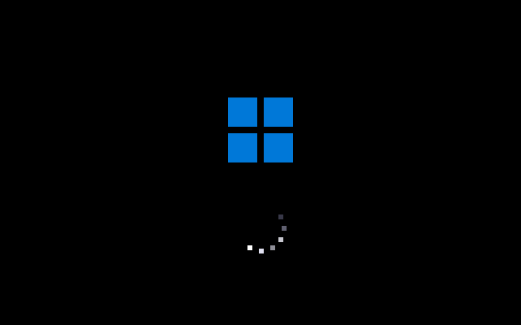
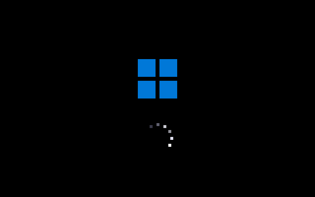
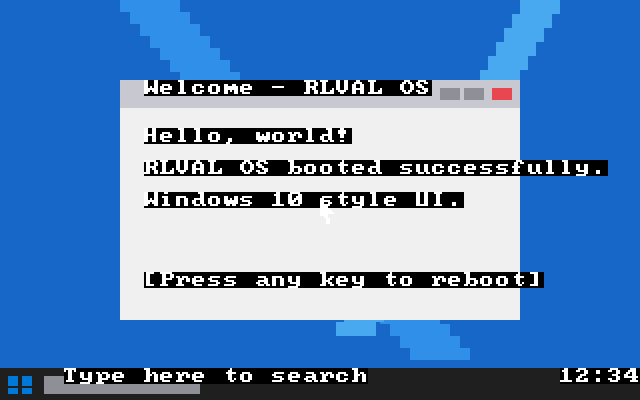

# RLVAL OS — a tiny real bootable operating system (Windows 10 themed)

A small but **genuinely real** x86 operating system that boots from a 512-byte
boot sector, switches the VGA card into 320×200 256-color graphics mode, and
displays a **Windows 10-style boot screen** (4-pane logo + rotating dot
spinner on pure black) before transitioning to a Windows 10-style desktop
(blue hero wallpaper, dark taskbar with Start button, search box, clock, and
an open "Welcome" window with min/max/red-close buttons).

Written in pure NASM x86 assembly — no kernel, no libraries, no Linux
underneath. It runs on the bare metal of a virtual (or real) PC.

> *(Project folder is still named `myos/` from earlier versions — the bootable
> image and OS itself are RLVAL OS.)*

## Screenshots

### Windows 10-style boot screen

| Spinner frame 1 | Spinner frame 2 |
|---|---|
|  |  |

Pure black background, the familiar 4-pane Windows-style logo in blue, and a
ring of small dots below it. The bright "head" dot rotates around the circle
with a fading trail behind it — the same comet-like motion Windows 10 shows
during startup and sign-in.

### Windows 10-style desktop



- **Blue hero wallpaper** with stylized diagonal "rays" of lighter blue
- **Dark full-width taskbar** at the bottom
- **Start button** on the left (mini 4-pane Win logo)
- **"Type here to search"** box next to it
- **Clock** ("12:34") on the right
- **Welcome window** in the middle with a light Win 10 title bar, three window
  buttons (minimize / maximize / **red close**), and body text
- Mouse cursor arrow in the middle of the window

## What's in the box

| File | Purpose |
|---|---|
| `boot.asm` | 512-byte stage-1 bootloader |
| `kernel.asm` | The kernel: mode-13h graphics, palette, Win 10 boot animation, desktop GUI |
| `build.sh` | Assembles both files and produces a bootable floppy image |
| **`rlval.img`** | The 1.44 MB bootable disk image (give this to QEMU) |

## Requirements

1. **NASM** — only required if you want to rebuild from source
2. **QEMU** (`qemu-system-i386`) — to actually run the OS

### Install

```bash
# Debian/Ubuntu
sudo apt-get install nasm qemu-system-x86

# macOS (Homebrew)
brew install nasm qemu

# Windows: download NASM from nasm.us and QEMU from qemu.org
```

## How to run it

The disk image is already built. Just point QEMU at it:

```bash
qemu-system-i386 -fda rlval.img -boot a
```

A QEMU window will open and you'll see:

1. BIOS POST, then `Booting RLVAL OS...` from the bootloader.
2. **Win 10 boot screen**: black background, blue 4-pane logo, rotating
   dot spinner below it.
3. **Win 10 desktop** appears: blue wallpaper with rays, taskbar, Welcome window.
4. **Press any key** to reboot (warm `INT 19h`).

### Alternative invocations

```bash
qemu-system-x86_64 -fda rlval.img -boot a                            # 64-bit emulator works too
qemu-system-i386 -drive file=rlval.img,format=raw,if=floppy -boot a  # silences raw-format warning
```

## Rebuilding from source

```bash
./build.sh           # rebuild boot.bin, kernel.bin, rlval.img
./build.sh run       # rebuild and immediately launch in QEMU
./build.sh clean     # delete build artifacts
```

## Running on other hypervisors / real hardware

### VirtualBox
1. New VM → Type: Other, Version: Other/Unknown
2. RAM: 64 MB is plenty; **don't** create a hard disk
3. Settings → Storage → Floppy controller → add `rlval.img`
4. Settings → System → Boot Order: Floppy first
5. Start

### VMware
1. New VM → "I will install the OS later" → Other / Other
2. Customize hardware → add **Floppy** drive → use `rlval.img`

### Real USB stick ⚠️ (destroys target drive — be careful!)
```bash
# Linux
sudo dd if=rlval.img of=/dev/sdX bs=512 conv=fsync     # X = your USB stick
# macOS
sudo dd if=rlval.img of=/dev/diskN bs=512               # N = your USB disk
```
Then boot the target PC. Works best on PCs with legacy BIOS / CSM enabled.

## How the Windows 10 spinner works

The real Windows 10 boot spinner is a ring of small white dots where a few in
sequence are bright (the "head" plus a short trail), the rest are dim, and the
bright group rotates clockwise around the ring at a steady rate — a comet
chasing its tail. We replicate this in `draw_spinner` (`kernel.asm`):

- **12 dots** arranged on a circle of radius 14 around (160, 140), at 30° intervals
- Each frame, `head = frame % 12` picks which dot is currently brightest
- For each dot `i`, the "distance behind head" is `(head - i) mod 12`
  - Distance 0 → palette index 8 (pure white) — the head
  - Distance 1 → index 4 (very light grey)
  - Distance 2 → index 14 (medium grey)
  - Distance 3 → index 15 (darker grey)
  - Distance 4 → index 12 (dim)
  - Distance 5 → index 13 (very dim)
  - Distance 6+ → index 0 (black, "off")
- Each frame we erase a 40×40 box behind the spinner and redraw all 12 dots
  with the rotated brightness pattern

The Windows 10 logo is drawn in `draw_win_logo` as four 18×18 blue squares
arranged 2×2 with a 4 px gap, centered around (160, 80).

## Technical notes

- **Boot sector** (`boot.asm`): 512 bytes, ends with the magic `0xAA55` BIOS
  signature. Uses `INT 13h` to copy 32 sectors to segment `0x1000`, then far-jumps.
- **Kernel** (`kernel.asm`): stays in 16-bit real mode. Enters VGA mode 13h via
  `INT 10h, AX=0013h` — a flat 64 KB framebuffer at `0xA0000`.
- **Custom palette**: 17 DAC entries programmed via I/O for Windows 10 colors:
  Win blue `#0078D7`, hero wallpaper blue, dark taskbar, light window body,
  red close-button accent, plus 4+ shades of grey for the spinner trail.
- **Drawing primitive**: A single `fill_rect` that reads its args from globals
  (`rx`, `ry`, `rw`, `rh`, `rc`) — keeps 16-bit register management sane.
- **Text**: BIOS teletype `INT 10h, AH=0Eh` (works in mode 13h, uses the
  built-in 8×8 BIOS font).
- **Reboot**: `INT 19h` warm reboot.

## Limitations (it's a toy OS!)

- No protected mode, paging, or multitasking
- No real mouse driver (cursor drawn at a fixed position)
- No keyboard input beyond "press any key to reboot"
- No filesystem
- BIOS teletype gives text a black-background highlight that we can't easily
  remove in mode 13h — gives the desktop text a slightly retro look
- Animation timing is a busy-loop calibrated for QEMU on a modern host

## License

Public domain / CC0. Hack on it freely.
